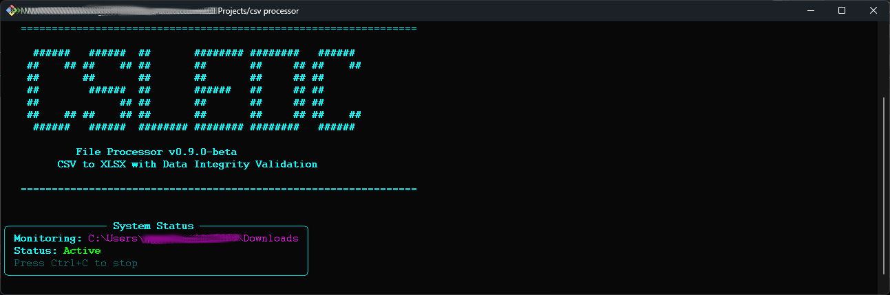
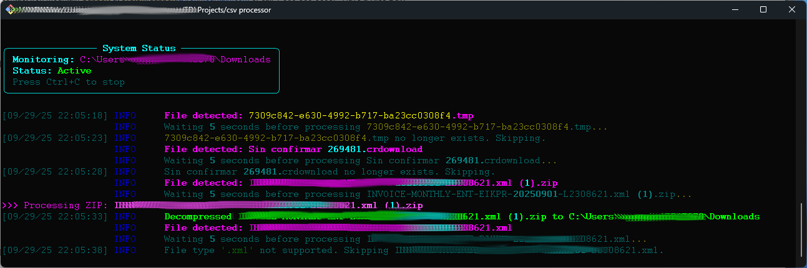
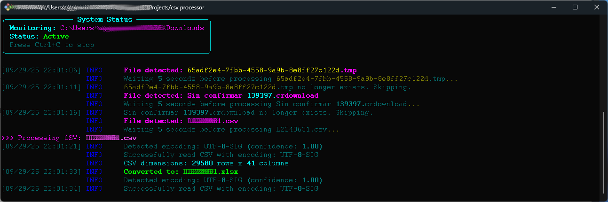

# CSV EDI File Processor

**Version:** 0.9.0-beta
**Status:** Beta - Production Testing Phase

Professional-grade EDI file processor with data integrity validation, automatic encoding detection, and type preservation. Monitors your Downloads folder and automatically processes CSV, ZIP, and 7z files with comprehensive validation.

---

## Features

### Core Functionality
- **Automatic File Monitoring**: Real-time watchdog monitoring of Downloads directory
- **CSV to XLSX Conversion**: High-fidelity conversion with data integrity validation
- **Archive Extraction**: Automatic decompression of ZIP and 7z files
- **Modern CLI Interface**: Professional colored terminal output with Rich library

### Data Integrity Validation
- **Four-Point Validation System**:
  - Dimension verification (rows and columns)
  - Column name preservation
  - Data type consistency checking
  - Sample data accuracy validation
- **Safe Failover**: Original CSV files retained if validation fails
- **Detailed Logging**: All operations logged to `file_processing.log`

### Advanced Data Processing
- **Encoding Auto-Detection**: Supports UTF-8, Latin-1, CP1252, ISO-8859-1
- **Precision Preservation**: 15-digit floating-point precision maintained
- **Type Intelligence**: Smart numeric type inference without data loss
- **Error Recovery**: Graceful handling of corrupted or malformed files

---

## Requirements

- **Python**: 3.12 or higher
- **Operating System**: Windows, macOS, Linux
- **Dependencies**: Automatically managed via `uv` or `pip`

---

## Installation

### Using uv (Recommended)

```bash
cd "csv processor"
uv sync
```

### Using pip

```bash
pip install -r requirements.txt
```

Or install dependencies manually:
```bash
pip install chardet numpy openpyxl pandas py7zr rich watchdog
```

---

## Usage

### Start the Processor

```bash
python main.py
```



The processor will:
1. Display art banner
2. Show system status panel
3. Begin monitoring your Downloads folder
4. Process files automatically as they appear




### Stop the Processor

Press `Ctrl+C` to gracefully shutdown the processor.

### Supported File Types

| Extension | Action | Output |
|-----------|--------|--------|
| `.csv` | Convert to XLSX with validation | `.xlsx` file (CSV deleted if valid) |
| `.zip` | Extract contents | Files extracted to same directory |
| `.7z` | Extract contents | Files extracted to same directory |

### Ignored Files

Temporary files are automatically ignored:
- `.tmp`
- `.crdownload` (Chrome)
- `.part` (Firefox)

---

## Data Integrity Validation

Every CSV conversion undergoes comprehensive validation:

### Validation Checks

1. **Dimensions Match**: Verifies row and column counts are preserved
2. **Columns Match**: Ensures all column names are identical
3. **Data Types Preserved**: Checks that data types remain consistent
4. **Sample Data Match**: Validates first 5 rows for accuracy

### Validation Outcomes

**Pass**: Original CSV deleted, XLSX file retained
**Fail**: Both CSV and XLSX retained for manual review

### Example Output




```
>>> Processing CSV: invoice_data.csv
INFO CSV dimensions: 1500 rows x 12 columns
SUCCESS Converted to: invoice_data.xlsx
VALIDATION PASSED Data integrity confirmed
```

---

## Configuration

### Monitored Directory

Default: `~/Downloads`

To change the monitored directory, edit `main.py`:

```python
downloads_path = Path.home() / "Downloads"  # Change this path
```

### Logging

All operations are logged to `file_processing.log` in the working directory with:
- Timestamp
- Log level (INFO, WARNING, ERROR)
- Detailed message

---

## Architecture

### Project Structure

```
csv processor/